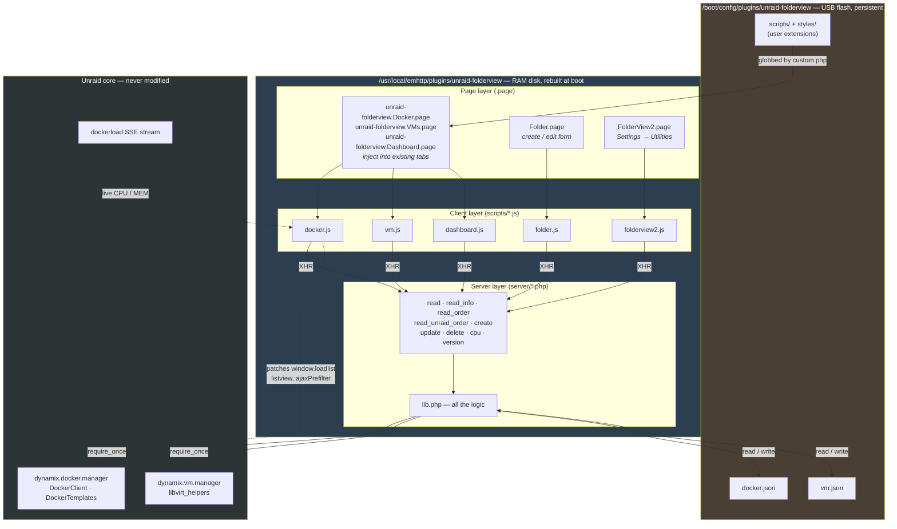
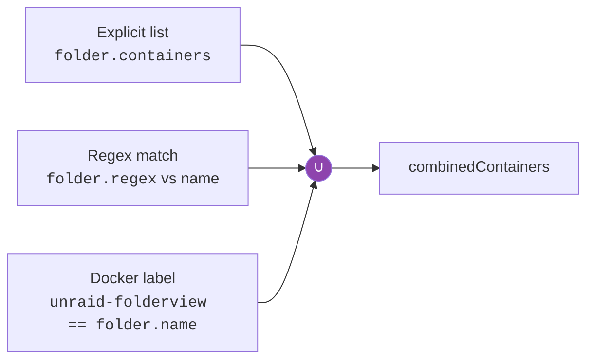
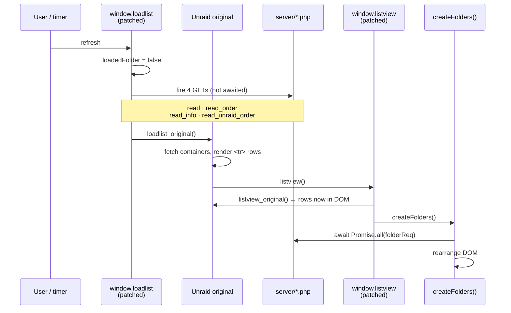
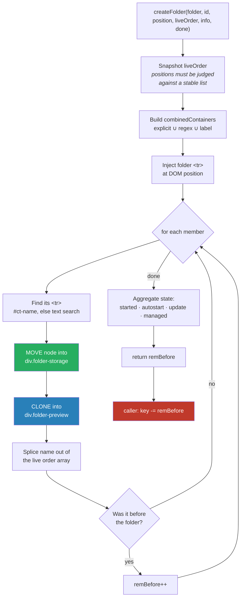
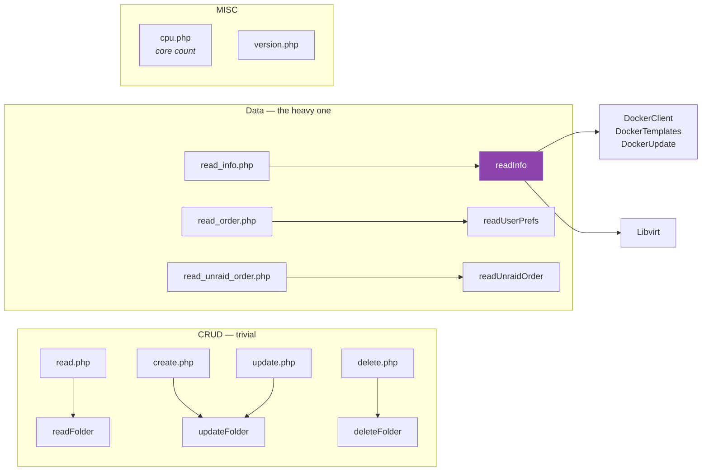
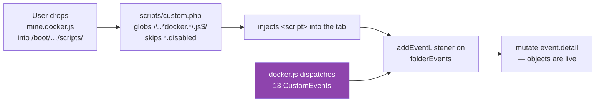

# ARCHITECTURE.md

How FolderView2 is built, and why it is built that way. For orientation, setup, and
workflow see [CONTEXT.md](CONTEXT.md).

---

## 1. The constraint that shapes everything

Unraid's Docker tab is rendered by `dynamix.docker.manager`, a first-party page the
plugin cannot modify. There is no extension point, no hook, no slot. Unraid renders
a flat `<table id="docker_containers">` of container rows and that is the end of its
contract with you.

So the plugin has exactly three ways in:

| Approach | Cost |
|---|---|
| Fork the Docker tab | Must re-fork every Unraid release. Fatal. |
| Re-render the list yourself from the Docker API | Must reimplement every behaviour Unraid attaches to a row: context menus, log links, update checks, autostart switches, SSE stat wiring. Enormous, and it drifts. |
| **Let Unraid render, then rearrange the DOM** | Fragile against internal changes — but everything Unraid does keeps working, for free. |

FolderView2 takes the third path, and this one decision explains nearly every
structural quirk in the codebase. The plugin is best understood not as an
application but as **a post-processor for someone else's page**.

The crucial payoff: when a container ends up inside a folder, its `<tr>` is the
*same DOM node Unraid created*, physically relocated. Not a copy, not a re-render.
Its start/stop menu, its update indicator, its autostart toggle, its live-stat
bindings — all still Unraid's, all still working, with zero plugin code. A
re-implementation would have had to own all of that and keep owning it forever.

---

## 2. System layers



Four layers, each thin:

- **Page layer** — Unraid's `.page` files: front-matter (`Menu`, `Title`, `Icon`)
  plus PHP/HTML. `Menu="Docker"` is the entire mechanism by which the plugin injects
  itself into the stock Docker tab. The three tab pages contain almost no logic —
  they set `$type`, pull in i18n, glob user extensions, and load the real script.
- **Server layer** — nine endpoints, seven of which are 3 lines. All logic lives in
  `lib.php`. The endpoints exist only to be URLs.
- **Client layer** — where the work happens. 4,501 lines across the five scripts,
  excluding the vendored `include/` directory.
- **Unraid core** — consumed via `require_once` on the PHP side and monkey-patching
  on the JS side. Never modified.

---

## 3. The data model

Two JSON files on flash, keyed by a random 20-char ID
([`generateId`](src/unraid-folderview/usr/local/emhttp/plugins/unraid-folderview/server/lib.php#L107)):

```jsonc
{
  "Ax7Kq2mNp9RtVw3ZcYb1": {
    "name": "Media",
    "icon": "https://…/plex.png",   // URL or data:image/…;base64
    "settings": { "preview": 1, "context": 2, "expand_tab": false, … },
    "regex": "^arr-",                // dynamic membership
    "containers": ["plex", "sonarr"],// explicit membership
    "actions": [ { "type": 0, "action": 1, "modes": 0, "conatiners": […] } ]
  }
}
```

Notes that matter:

- **The ID is never shown and never derived from the name.** Renaming a folder
  cannot orphan it, and two folders can share a name. Cheap and correct.
- **`settings` is a flat bag of 20 fields** written by
  [`submitForm`](src/unraid-folderview/usr/local/emhttp/plugins/unraid-folderview/scripts/folder.js#L247)
  and read with `?.` + `||` defaults everywhere. There is no schema and no migration
  step — a folder written by a 2023 build still loads, because every consumer
  defaults each missing field individually. Crude, but it has survived two years of
  additions without a single migration. The cost is that the defaults are scattered
  across every read site instead of stated once.
- **`conatiners` (sic) inside `actions`** is a persisted typo. It is in users' JSON
  files on flash. Do not "fix" it without a migration.

### Membership is a union of three sources



Three mechanisms for one concept looks like over-design until you see who each
serves. The explicit list is for humans clicking checkboxes. The regex is for naming
conventions (`^arr-`, or Pterodactyl's UUID-named eggs — the tooltip in
[Folder.page:390](src/unraid-folderview/usr/local/emhttp/plugins/unraid-folderview/Folder.page#L390)
gives exactly that example). The **label** is the important one: it lets a
`docker-compose.yml` declare its own folder membership, so a stack that is torn down
and recreated lands back in the right folder without anyone touching the UI. That is
the docker-compose use case named in the README, and neither of the other two
mechanisms can serve it.

Because that label lives in *users'* compose files rather than in this plugin's
config, the 2026.08.07 rename could not simply change it. Both `unraid-folderview`
and the legacy `folder.view2` are accepted, new name first. This is the general
shape of the problem with any identifier you hand to users: you can rename what you
own, but not what they wrote down.

The union is computed in
[`createFolder`](src/unraid-folderview/usr/local/emhttp/plugins/unraid-folderview/scripts/docker.js#L235-L267),
explicit-first, with `includes` guards preventing double-add. Note the asymmetry:
the regex is evaluated **client-side** at render time, so it re-evaluates on every
refresh and picks up new containers automatically — no persistence, no staleness.

---

## 4. The render pipeline — the core of the plugin

### 4.1 Interception

The plugin needs to run *after* Unraid has drawn its table but *before* the user
sees it. There is no event for that, so it wraps the functions that do the drawing:



Two details worth stealing:

**The four requests are fired in the patched `loadlist` but awaited in
`createFolders`** ([docker.js:1543](src/unraid-folderview/usr/local/emhttp/plugins/unraid-folderview/scripts/docker.js#L1543)
vs [docker.js:12](src/unraid-folderview/usr/local/emhttp/plugins/unraid-folderview/scripts/docker.js#L12)).
The plugin's network round-trips overlap Unraid's own render entirely. By the time
there is a DOM to rearrange, the folder data has usually already arrived. The
changelog entry "now folder load faster" is this change. It is a genuinely nice
piece of engineering hiding in otherwise workmanlike code.

**`loadedFolder` is a one-shot guard.** `listview` can fire more than once per load;
the flag ensures folders are built exactly once and reset only by a fresh `loadlist`.

The Dashboard and VM tabs have no equivalent global to patch, so they intercept
differently — `$.ajaxPrefilter` watches for `DashboardApps.php` / `VMMachines.php`
and chains off the jqXHR promise
([dashboard.js tail](src/unraid-folderview/usr/local/emhttp/plugins/unraid-folderview/scripts/dashboard.js),
[vm.js tail](src/unraid-folderview/usr/local/emhttp/plugins/unraid-folderview/scripts/vm.js)).
Same idea, two mechanisms across three tabs, because the host page dictates it.

### The undeclared dependency surface

The patched functions are the *visible* coupling to Unraid, and they are easy to
grep for. The dangerous coupling is the set of host-page globals the plugin simply
assumes exist — no declaration, no guard, no grep-able patch site:

| Symbol | Used at | Breaks if renamed |
|---|---|---|
| `eventURL` | [docker.js:1238](src/unraid-folderview/usr/local/emhttp/plugins/unraid-folderview/scripts/docker.js#L1238) | Every Docker folder action. Note `vm.js:505` declares its own; `docker.js` never does. |
| `dockerload` | [docker.js:1570](src/unraid-folderview/usr/local/emhttp/plugins/unraid-folderview/scripts/docker.js#L1570) | Live CPU/MEM on folders and in the advanced tooltip. |
| `switchButton` | [docker.js:295](src/unraid-folderview/usr/local/emhttp/plugins/unraid-folderview/scripts/docker.js#L295) | The folder autostart toggle. |
| `openBox` / `openDocker` | `folderCustomAction`, `updateFolder` | Custom actions and folder updates. |
| `autov` | every `.page` | Cache-busted asset URLs. |
| `docker_listview_mode` cookie | [docker.js:231](src/unraid-folderview/usr/local/emhttp/plugins/unraid-folderview/scripts/docker.js#L231) | Advanced-view column layout. |

Plus one external plugin: **User Scripts** must be installed for type-1 custom
actions to work at all. Nothing degrades gracefully — these are bare references.

### 4.2 Folders as pseudo-containers

The clever structural trick: a folder is stored in **Unraid's own ordering array**
as an entry named `folder-<id>`.

Unraid persists user drag-and-drop order in `dockerMan/userprefs.cfg`. Because a
folder occupies a slot in that list like any container, drag-ordering a folder among
containers Just Works — Unraid persists it without knowing folders exist. No
parallel ordering system, no sync problem.

The price is one lie the plugin must maintain. Unraid re-numbers the order on save
and gets confused by the extra entries, so `$.ajaxPrefilter` rewrites the outgoing
`UserPrefs.php` payload, regenerating a clean `0;1;2;…` index sequence
([docker.js:1728](src/unraid-folderview/usr/local/emhttp/plugins/unraid-folderview/scripts/docker.js#L1728)).
The VM variant additionally runs `/^(.*?)(?=folder-)/g` over each name, stripping
whatever *precedes* a `folder-` marker in the names field.
This is the seam of the whole design: a five-line interceptor keeping a first-party
feature honest about rows it doesn't know exist.

### 4.3 Reconciling two orderings

`createFolders` consumes two different order lists, and the naming is actively
misleading:

| Endpoint | JS variable | What it actually is |
|---|---|---|
| `read_order.php` → `readUserPrefs` | `unraidOrder` | Saved user order from `userprefs.cfg` — **includes `folder-*` entries** |
| `read_unraid_order.php` → `readUnraidOrder` | `order` | Live container list, sorted to match prefs — **containers only** |

The variable names are swapped relative to the endpoint names. Expect to re-read
this every time.

The reconciliation ([docker.js:32-43](src/unraid-folderview/usr/local/emhttp/plugins/unraid-folderview/scripts/docker.js#L32-L43)):

1. `newOnes` = containers in the live list but not in saved prefs — i.e. containers
   created since the last drag-order. These have no saved position.
2. Walk saved prefs; wherever a `folder-*` entry appears **and** that folder still
   exists in `docker.json`, splice it into the live list at `index + newOnes.length`.

The `+ newOnes.length` offset compensates for new containers shifting every saved
index. **Its premise is correct but its input is not** — and this is worth reading
carefully, because it is a live inconsistency rather than a resolved design.

Unraid sorts containers absent from prefs with `array_search(...)` returning `false`,
which under `SORT_NUMERIC` is `0` — so *Unraid puts new containers at the front*.
The offset is written for exactly that. But the array being offset comes from the
plugin's own `readUnraidOrder`, which assigns unknown containers
`$count + count($sort) + 1`
([lib.php:411](src/unraid-folderview/usr/local/emhttp/plugins/unraid-folderview/server/lib.php#L411))
— *the back*. The two disagree precisely when `newOnes` is non-empty, i.e. whenever
a container has been created since the last manual drag-order.

That matters more than it looks, because `key` is used as **both** an array index and
a DOM index — [docker.js:283](src/unraid-folderview/usr/local/emhttp/plugins/unraid-folderview/scripts/docker.js#L283)
inserts the folder row at `$('#docker_list > tr.sortable').eq(key - 1)`. When the
array and the DOM disagree about where new containers sit, the folder lands in the
wrong place. This is the most likely root cause behind the recurring
"folder appears in the wrong position" entries in the changelog, and it is the first
thing the two-phase refactor in §7 would resolve.

The debug-JSON dump exists precisely to make this state inspectable — dump it before
and after creating a container and the divergence is visible directly.

### 4.4 Building one folder



Three things to understand here.

**Move vs clone.** The real `<tr>` is *moved* into a hidden `div.folder-storage`
(green). A *clone* goes into `div.folder-preview` (blue) to render the little icon
strip. Move preserves Unraid's handlers on the live row; clone is disposable
chrome. Expanding a folder just moves the stored rows back out after the folder row
— which is why an expanded folder behaves exactly like the normal list, because it
*is* the normal list.

**The `remBefore` dance** (red) is the fragile heart. `createFolders` iterates the
order array while `createFolder` splices entries out of that same array. Every
absorbed container that sat *before* the folder's slot shifts the loop's own cursor
backwards by one, so the child returns a count and the parent rewinds `key` by it
([docker.js:124-126](src/unraid-folderview/usr/local/emhttp/plugins/unraid-folderview/scripts/docker.js#L124-L126)).
This works. It is also index arithmetic over a live-mutated array with a DOM write
in the middle, and the changelog documents at least six bugs traceable to it
("folder were offsetting index on the grabbing", "issue preventing folders from
appearing when a container was before a folder", …). A two-pass design — compute
the final arrangement into a new array, then apply it to the DOM — would remove the
entire class of bug. It is the single highest-value refactor available in this
codebase.

**Aggregation is a fold over members.** A folder's displayed state (running count,
update-available, autostart, managed-vs-unmanaged) is derived on each render from
its members. Nothing is cached, so it cannot go stale. For folder-sized N this is
free, and it removes an invalidation problem entirely — the right call.

---

## 5. The server side

Nine endpoints, seven of them three lines. All real work is in
[`lib.php`](src/unraid-folderview/usr/local/emhttp/plugins/unraid-folderview/server/lib.php).



### `readInfo` — where the complexity actually lives

This one function ([lib.php:118-395](src/unraid-folderview/usr/local/emhttp/plugins/unraid-folderview/server/lib.php#L118-L395))
is ~55% of the PHP. It assembles the per-container payload the UI needs, and it has
one genuinely good optimisation and one genuinely expensive habit.

**Good: templates are pre-parsed once.** Unraid stores per-container metadata
(WebUI URL, shell, support links) in XML templates. The naive shape is "for each
container, find and parse its template" — O(containers × templates) DOM parses. The
code instead parses every template once up front into a map keyed `name|image`
([lib.php:136-158](src/unraid-folderview/usr/local/emhttp/plugins/unraid-folderview/server/lib.php#L136-L158))
and then does O(1) lookups. Small change, real win on a 40-container server.

**Fallback chain: XML template → Docker labels.** A container is `dockerman`-managed
(has a template) or it isn't (compose, CLI, Portainer). Rather than degrade
gracefully for the latter, the code reads the same fields from
`net.unraid.docker.*` labels — the exact convention Unraid itself uses for unmanaged
containers. So a compose-created container gets a working WebUI button. The changelog
shows this being learned the hard way over several releases ("WebUi and shell values
are taken from labels if a template is not available", "handle non dockerman webui
templates"). It is now the load-bearing path for compose users, who are the stated
target audience.

**WebUI resolution** is a small template language: `[IP]` and `[PORT:nnnn]`
placeholders resolved against the container's actual network mode, with four
distinct cases (host / bridge / custom / none), and `[PORT:nnnn]` mapped through the
*published* port rather than the internal one
([lib.php:285-311](src/unraid-folderview/usr/local/emhttp/plugins/unraid-folderview/server/lib.php#L285-L311)).
This is reimplementing Unraid's own logic rather than calling it — a maintenance
liability, but Unraid exposes no reusable function for it.

**Expensive: Tailscale resolution shells out.** `[hostname]` and `[noserve]`
placeholders require asking the container itself, via
`docker exec <name> tailscale …`
([lib.php:29-71](src/unraid-folderview/usr/local/emhttp/plugins/unraid-folderview/server/lib.php#L29-L71)).
Up to two `exec` calls per Tailscale container, synchronously, **on every list
refresh**. Injection is guarded correctly — a `^[a-zA-Z0-9_.-]+$` name check *and*
`escapeshellarg` — but a `docker exec` costs 50-200ms and they are serial. Ten such
containers is a visible stall. A short-lived cache keyed on container ID would cost
about ten lines.

### `readUnraidOrder` — an *approximate* reimplementation that has already drifted

To interleave folders correctly, the plugin needs the container order exactly as
Unraid computes it. There is no exported function to call, so it re-derives it: read
`userprefs.cfg`, build a sort key per container, `array_multisort`, with a
`strnatcasecmp` fallback
([lib.php:397-463](src/unraid-folderview/usr/local/emhttp/plugins/unraid-folderview/server/lib.php#L397-L463)).

It does **not** match Unraid, on the one case that matters most:

| | Unraid (`DockerContainers.php:37-39`) | Plugin (`lib.php:411`) |
|---|---|---|
| Container **in** prefs | `array_search` → its index | same |
| Container **absent** from prefs | `false` → `0` → sorts to **front** | `$count + n + 1` → sorts to **back** |
| Prefs missing / unparseable | no fallback | three added `strnatcasecmp` / `natcasesort` branches |

Duplicated logic that drifts is the expected failure mode here; what makes it worth
flagging loudly is that it has *already* drifted, silently, and in the exact
direction that breaks §4.3's offset arithmetic. Do not treat this function as a
trustworthy mirror of Unraid — treat it as the other half of the ordering bug.

---

## 6. Extension system

An unusually thoughtful piece for a plugin this size — and the only part of the
codebase with a designed API rather than an accreted one.



`folderEvents` is a bare `EventTarget` — the entire mechanism is
[one line](src/unraid-folderview/usr/local/emhttp/plugins/unraid-folderview/scripts/include/customEvents.js).

**Thirteen `docker-*` events** fire around the render lifecycle, in matched pairs
except the last: `docker-{pre,post}-folders-creation`,
`docker-{pre,post}-folder-creation`, `docker-{pre,post}-folder-preview`,
`docker-{pre,post}-folder-expansion`, `docker-tooltip-before` /
`docker-tooltip-after`, `docker-tooltip-ready-start` / `docker-tooltip-ready-end`,
and `docker-folder-context`.

**There is also a separate nine-event `vm-*` family**, dispatched by `vm.js`.
`dashboard.js` dispatches *both* families, because it renders both types. The dev
guide documents the docker set; an extension author targeting VMs has to read
`vm.js` to discover the rest.

Two design choices carry the weight:

**`detail` carries live object references, not copies.** A listener on
`docker-folder-context` receives the `opts` array *before* it is handed to the
context-menu library, and can push its own entries into it. A listener on
`docker-pre-folder-creation` can rewrite the folder definition before it renders.
No registration API, no plugin manifest, no permission model — mutate the object and
the plugin uses your version. Wide open, and exactly right for a homelab tool where
the extension author and the operator are the same person.

**Filename-as-routing.** `mine.docker.js` loads on the Docker tab;
`mine.dashboard-docker.js` on both. A regex glob against the filename replaces what
would otherwise be a registration file, a manifest format, and the code to parse
them. Zero config, and the rule fits in one line of
[dev/README.md](dev/README.md).

The `dev/` directory ships commented event templates and HTML snapshots of the
generated markup, so an extension author can see the DOM they're targeting without
installing anything. Small thing; most plugins of this size ship nothing.

The one gap: styling is CSS-only by policy ("you can't change the template.html
because it is hard-coded"). The markup is a single ~1,950-character template literal
in `createFolder`. Extension authors can restyle anything and restructure nothing.

---

## 7. Honest assessment

### What is genuinely good

- **The move-don't-render decision.** Inheriting every Unraid behaviour for free,
  permanently, is worth every bit of the fragility it costs. A re-render approach
  would have died at Unraid 6.10.
- **Folders-as-pseudo-containers.** Reusing Unraid's own ordering storage instead of
  building a parallel one eliminates a whole category of sync bug.
- **Request/render overlap.** Firing the four XHRs in the patched `loadlist` and
  awaiting them in `createFolders` is free latency, correctly obtained.
- **Three membership mechanisms.** Looks redundant; each serves a real, distinct
  user. The label mechanism in particular is what makes the compose story work.
- **Template pre-parsing** in `readInfo` — the one place the code chose an algorithm
  rather than the obvious loop.
- **The extension system.** Event-based, zero-config, documented, with templates.
  Punches above the project's weight.
- **The `debug` keystroke dump.** A tool built specifically to make the hardest part
  of the system (order reconciliation) inspectable. Most projects this size have
  nothing.

### What is genuinely weak

**Triplication is the dominant problem.** `docker.js` (1752), `dashboard.js` (1341),
`vm.js` (772) implement the same lifecycle three times — and `dashboard.js` does it
twice internally, once per type. That is ~3,800 lines where perhaps 1,400 of distinct
behaviour exists. The differences are real (different DOM targets, different action
endpoints, different intercept points) but they are *parameters*, not architecture.
A shared core taking a per-type strategy object would collapse it. Today, every fix
must be found and applied in three or four places, and the ones that get missed are
exactly the "small fix for VMs" entries that recur through the changelog.

**Index arithmetic over a mutating array.** §4.4. The highest-value refactor in the
repo: compute the arrangement, then apply it.

**Debug logging as production code.** ~290 of `docker.js`'s 1752 lines are
`if (FOLDER_VIEW_DEBUG_MODE) console.log(...)`, interleaved with logic at roughly
one line in six. It obscures the code it documents, and it is dead in every shipped
build. A no-op `log()` helper would recover the readability at no cost.

**A genuine security chain, not a hygiene nit.** Three gaps compose into one
remotely-reachable vulnerability against a root-privileged UI
([CONTEXT.md §7.3](CONTEXT.md#7-sharp-edges--verified-not-speculative)): no
`csrf_token` on the mutating endpoints (with `delete.php` mutating on `GET`),
unwhitelisted `type` reaching a filesystem path, and a rendering layer that builds
every row, preview and tooltip by string concatenation with no escaping anywhere —
`folder.name` and `folder.icon` at
[docker.js:270](src/unraid-folderview/usr/local/emhttp/plugins/unraid-folderview/scripts/docker.js#L270)
are the attacker-reachable pair, but the container-supplied Tailscale `DNSName`
reaches an `href` unvalidated too.
Session auth is not a mitigation — CSRF is the attack where the victim's session is
already valid. The saving grace is that each fix is independent and small; ~25 lines
closes all three. `readUserPrefs` at
[lib.php:81-84](src/unraid-folderview/usr/local/emhttp/plugins/unraid-folderview/server/lib.php#L81-L84)
already whitelists correctly, so the pattern is in the codebase — it just wasn't
applied to the other five call sites.

**Two broken release-manifest facts** — the `master`-vs-`main` package URL and the
stale version entity, both of which would make a fresh install fail or fetch the
wrong build. **Fixed on this branch**, but upstream still carries both, so they
return on any merge from there. The underlying fragility remains: `version` and
`md5` are entities the `<URL>` is built from, so a wrong value fails silently at
install time rather than loudly at edit time.

**No tests, no CI, no linter.** Understandable — nothing here runs off an Unraid
box. But `lib.php`'s pure functions (`readUnraidOrder`'s sort, `dirToArrayOfFiles`,
the WebUI placeholder resolution) and `docker.js`'s (`memToB`, `bToMem`, and a
extracted order-reconciliation function) are all testable in isolation. The order
reconciliation is where the bugs actually are, and it is pure input→output. That is
the test suite worth having, and it is small.

### If you were redesigning it

Keep the DOM-relocation strategy — it is the correct answer to the constraint and it
has been vindicated over two years. Change three things:

1. **One core, three adapters.** A single `folderEngine(config)` where config supplies
   selectors, endpoints, and intercept strategy. Collapses ~3,800 lines to ~1,400 and
   makes "small fix for VMs" a phrase that never appears again.
2. **Two-phase render.** Phase one: pure function, `(folders, orders, info) → layout
   plan`. Phase two: apply the plan to the DOM. Phase one is unit-testable without a
   browser, and the `remBefore` bug class ceases to exist.
3. **A declared settings schema with one defaults object.** Replaces 20 fields'
   worth of `?.` and `||` scattered across every read site, and gives you a place to
   put migrations when you eventually need one.

None of that is required for the plugin to keep working. It is what would make the
next two years of Unraid releases cheaper than the last two.
